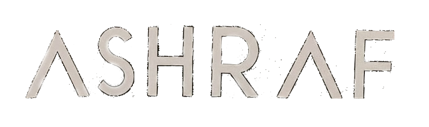

# Ashraf Attallah Portfolio

Welcome to my portfolio repository! This repository contains the source code for my personal portfolio website, where I showcase my skills, projects, and experiences as a developer.

## About Me

I'm Ashraf Attallah, a passionate developer with a love for problem-solving and creating meaningful projects. I have a keen eye for design and strive to build elegant and efficient solutions to real-world problems.

## Features

- **Structured Sections**: My portfolio is organized into different sections, making it easy to navigate and explore.
- **Animations and Transitions**: I've incorporated animations and transitions to add a dynamic and engaging touch to the website.
- **Interactive Elements**: Visitors can interact with buttons, image galleries, and other elements to explore my work further.
- **Responsive Design**: The portfolio is designed to be responsive, ensuring a seamless experience across different devices and screen sizes.

## Getting Started

To view my portfolio online, simply visit [here](https://ashraf00963.github.io/Protfolio/) in your web browser.

## Feedback and Contributions
--------------------------

I welcome any feedback or suggestions you may have regarding my portfolio. Feel free to open an issue or submit a pull request if you'd like to contribute to the project.

## Contact Me
----------

If you'd like to get in touch with me, you can reach out via email at `attallahashraf@gmail.com` or connect with me on [LinkedIn](https://www.linkedin.com/in/ashraf-attallah-a36330219/).

Thank you for visiting my portfolio!
